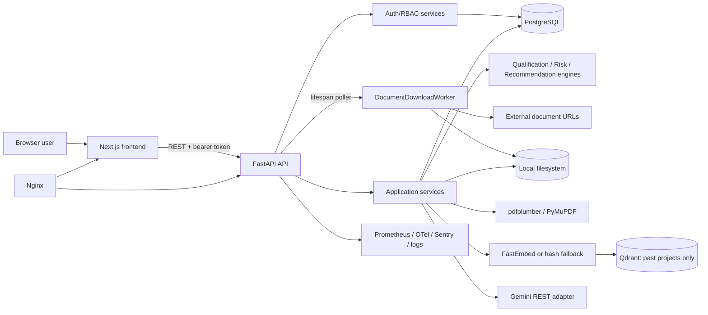
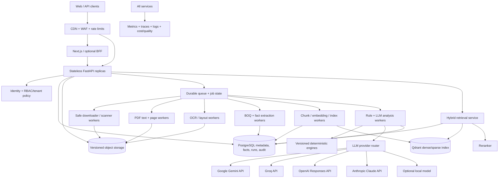

# Smart Tender System — Architecture, Complexity, and Scalability Assessment

**Assessment date:** 16 September 2026  
**Scope:** Entire repository, including backend, frontend, database models and migrations, tests, containers, and deployment configuration.  
**Constraint:** This assessment does not modify application code. Cost details are in [`smart_tender_cost_estimation.md`](smart_tender_cost_estimation.md); the client brief is in [`smart_tender_client_summary.md`](smart_tender_client_summary.md).

## Executive conclusion

The repository is a credible, well-tested modular monolith for a controlled pilot. Its strongest design decision is keeping qualification, risk, and recommendation rules deterministic while using an LLM only to narrate already-computed facts. The backend also has clean dependency boundaries, a typed frontend API layer, refresh-token rotation, structured logging, Prometheus hooks, and extensive tests.

It is **not yet a production tender-intelligence platform at material scale**. The decisive gaps are operational rather than cosmetic:

- document work runs inside the API process rather than on a durable queue;
- documents are stored on local disk and read into memory in full;
- URL ingestion is exposed to SSRF and untrusted-file risks;
- scanned PDF OCR, tender-document chunking, full-text search, tender RAG, citations, and document versioning do not exist;
- only past projects—not tender documents—are embedded in Qdrant;
- analysis and LLM reports are recomputed rather than persisted and versioned;
- the frontend tender detail view fans out into several calls that can duplicate analysis, matching, and LLM work;
- the data model is single-organization, with no tenant boundary.

The correct path is evolutionary: retain FastAPI, Next.js, PostgreSQL, the domain rule engines, and the existing provider interfaces; add object storage, a durable work queue, independent workers, page/chunk/evidence records, OCR fallback, hybrid retrieval, persisted analysis runs, and provider-routed LLM calls. A rewrite or premature microservice split is not justified.

For an Indian budget-conscious rollout, the first production shape should remain a **lean modular monolith**: one modest API/worker VM, a separate PostgreSQL/backup boundary, low-cost object storage, the current self-hosted Qdrant, local PDF/OCR/embedding processing, and usage-priced LLM APIs. Start in a suitable Indian region when residency or latency requires it. Redis, managed vector search, Kubernetes, Kafka, OpenSearch, paid OCR, and multi-region deployment are measurement-triggered upgrades—not pilot prerequisites. The detailed INR budget and vendor API comparison are in [`smart_tender_cost_estimation.md`](smart_tender_cost_estimation.md).

## 1. Assessment basis and repository evidence

The principal implementation evidence is:

- Backend composition and lifecycle: `backend/src/tender_intel/main.py`, `backend/src/tender_intel/core/`, and `backend/src/tender_intel/api/`.
- Domain rules and interfaces: `backend/src/tender_intel/domain/decision/`, `domain/entities/`, and `domain/interfaces/`.
- Application orchestration: `backend/src/tender_intel/application/services/`.
- SQLAlchemy schema: `backend/src/tender_intel/infrastructure/db/orm.py`; migrations under `backend/alembic/`.
- Download and storage: `infrastructure/downloader.py`, `infrastructure/storage.py`, and `infrastructure/workers/document_worker.py`.
- Extraction: `infrastructure/extraction/pdf_backends.py`, `boq_parser.py`, and `rule_metadata.py`.
- Vector and embedding adapters: `infrastructure/vector/qdrant_store.py` and `infrastructure/embeddings/`.
- LLM adapter: `domain/interfaces/providers.py`, `infrastructure/llm/gemini.py`, and `infrastructure/llm/factory.py`.
- Frontend: `frontend/src/app/`, `frontend/src/lib/api.ts`, `frontend/src/lib/tender-detail.ts`, and authentication providers/guards under `frontend/src/`.
- Deployment: `docker-compose.yml`, backend/frontend Dockerfiles, Nginx configuration, Render, Netlify, and Vercel artifacts.
- Quality evidence: backend tests under `backend/tests/` and frontend lint, type-check, and build scripts.

Where repository evidence does not establish a fact, this report says **Unknown**. In particular, real document-size distributions, scan rate, traffic concurrency, contractual availability target, retention period, recovery objectives, cloud region, tenant model, and production vendor discounts are Unknown.

## 2. Current implementation

### 2.1 Backend architecture

The Python backend is a FastAPI modular monolith with clean-architecture intent:

- `domain` contains framework-independent entities, repository/provider protocols, and deterministic decision engines.
- `application` coordinates use cases such as tender management, extraction, matching, decisions, reviews, and administration.
- `infrastructure` implements SQLAlchemy repositories, PDF extraction, local storage, HTTP download, embeddings, Qdrant, Gemini, security, telemetry, and the document poller.
- `api` exposes routers, schemas, dependencies, and middleware.
- `core` binds settings and dependencies.

This separation is valuable and should be preserved. The platform does not need separate network services for every domain today; the operationally expensive stages should first become independently deployable worker processes using the existing interfaces.

### 2.2 Frontend architecture

The frontend is Next.js 16 App Router with React 19, TypeScript, Tailwind CSS, Recharts, and Framer Motion. The landing page is server-renderable/static, while authenticated application screens are predominantly client components.

`frontend/src/lib/api.ts` is a typed fetch wrapper. It keeps the access token in memory, persists the refresh token in `localStorage`, attaches the bearer token, and performs one coordinated refresh/retry. `RequireAuth` is a presentation guard; backend authorization remains authoritative.

`frontend/src/lib/tender-detail.ts::fetchTenderDetail()` loads the tender and then starts eight optional requests in parallel: documents, metadata, BOQ, BOQ analytics, recommendation, report, reviews, and matches. This improves visible latency but has two weaknesses:

1. the helper suppresses all optional-call errors, including authorization and service failures, so partial outages can look like missing data;
2. recommendation, report, and matching paths can repeat decision/matching work, and the report call can repeat an LLM charge.

A composed read model or persisted analysis endpoint would reduce fan-out and make partial failures explicit.

### 2.3 API surface

The API is REST-oriented and grouped by responsibility:

- authentication: register, login, Google login, refresh, logout, and current user;
- tenders: CRUD and import;
- documents: URL registration, direct upload, retry, listing, and retrieval;
- extraction: extraction trigger, metadata, BOQ, and BOQ analytics;
- projects and matching;
- analysis, recommendation, and report;
- reviews, corrections, and verdicts;
- administration, roles, audit, statistics, health, metrics, and frontend log ingestion.

Role dependencies protect server operations. Most mutations are employee-level; administrative functions are admin-level; user deletion is super-admin-only. Review verdict assignment intentionally accepts `MANAGER` and `SUPER_ADMIN`, not `ADMIN`.

Long-running extraction and analysis are exposed as request/response operations rather than job resources. For production, commands should return `202 Accepted` with a job ID, while job status and results are fetched or streamed separately.

### 2.4 Authentication and authorization

Current strengths:

- PBKDF2-HMAC-SHA256 password hashing with random salts and 600,000 iterations;
- short-lived HS256 access tokens and seven-day refresh tokens;
- only a refresh-token hash is stored;
- refresh rotation and session revocation;
- current role is read from the database rather than trusted solely from a stale token claim;
- Google token audience and verified-email checks;
- production settings validate key secrets, PostgreSQL, allowed origins, and email-domain constraints.

Current risks:

- a refresh token in `localStorage` is retrievable by injected JavaScript;
- no MFA, password recovery flow, global/login rate limit, account lockout, or breached-password check was found;
- no Content Security Policy or comprehensive response-security headers were found in the inspected Next.js/Nginx configuration;
- HS256 uses one shared signing secret rather than asymmetric key rotation;
- no organization/tenant identity exists in schema or authorization checks;
- secrets are environment variables; a managed secret store and rotation process are not evidenced.

### 2.5 Database architecture

Production targets PostgreSQL; tests also use SQLite. The current relational model has ten main tables:

1. `users`
2. `role_assignments`
3. `user_sessions`
4. `tenders`
5. `tender_documents`
6. `tender_metadata`
7. `boq_items`
8. `past_projects`
9. `tender_reviews`
10. `audit_logs`

The schema is appropriate for a pilot but lacks first-class records for page text, chunks, evidence, document versions, extraction runs, analysis runs, LLM invocations, and background jobs. `raw_text` is duplicated between tender-document and metadata records. Re-extraction replaces BOQ rows, so historical reproducibility is lost. Audit rows are immutable by application convention, not protected by database append-only controls or tamper evidence.

Tender search uses a leading-wildcard `ILIKE` on title/tender number. Existing B-tree indexes do not make `%term%` selective; PostgreSQL trigram or `tsvector` indexing is needed. The document worker also needs a composite/partial queue index and lease semantics.

There is no tenant key. If this system is offered to multiple companies, tenant columns, composite uniqueness, authorization scope, object prefixes, vector payload filters, and preferably PostgreSQL row-level security are P0—not an optional future embellishment.

### 2.6 Document ingestion and storage

Current ingestion supports manual API/UI creation, URL documents, direct upload, and Excel tender import. Automated portal discovery, scheduled crawlers, email/API connectors, source rate controls, and source-change detection were not found.

URL documents enter `PENDING`. `DocumentDownloadWorker` polls every 15 seconds inside the FastAPI lifespan, lists a batch of ten, and processes it sequentially. `HttpxDownloader` follows redirects and loads the response body before checking the maximum size. `LocalFileStorage` writes a sanitized file beneath a local path. On success the tender becomes `DOWNLOADED`; failure marks the document `FAILED`, requiring manual retry.

Consequences:

- the work is not backed by a durable broker;
- multiple API replicas can claim the same pending row because there is no lease/lock;
- there is no exponential retry, maximum attempt count, or dead-letter queue;
- one slow URL blocks later items in the batch;
- API scale and worker concurrency cannot be tuned independently;
- local files are not durable or shared across replicas;
- Render/free or serverless files can disappear, and the Vercel entry point disables the worker entirely;
- direct uploads and downloads consume memory proportional to file size.

The computed SHA-256 is indexed but neither unique nor used for deduplication.

### 2.7 PDF extraction, OCR, metadata, and BOQ

`PdfPlumberTextExtractor` and `PyMuPDFTextExtractor` extract native PDF text. Pdfplumber also extracts tables. Work is generally moved to a thread from the extraction service, but past-project document creation invokes extraction from an async flow without the same clear offload and can block the event loop.

Current extraction limitations:

- no OCR implementation or scanned-page detection;
- no per-page text, bounding boxes, line positions, or extraction confidence;
- no parser sandbox, malware scan, decompression-bomb guard, or encrypted/corrupt-PDF workflow;
- the default extraction path selects one document rather than combining all documents for a tender;
- the complete file and substantial extracted content can coexist in memory;
- text is stored as large relational fields and duplicated.

`rule_metadata.py` uses label/regex extraction for a limited set of fields. It is deterministic and safe to operate, but captures the first matching labeled line, truncates values, and records a rule source rather than page/span evidence.

`boq_parser.py` finds table headers, skips total-like rows, and parses description, quantity, rate, and amount with a modest confidence score. It is a sensible baseline, but cannot reliably handle scans, merged cells, multi-page table continuation, repeated headers, table geometry, units/currencies, or revision provenance. A `page_number` exists in the BOQ model, but the current table abstraction does not preserve page identity sufficiently to populate it reliably.

### 2.8 Deterministic analysis

The strongest part of the design is under `domain/decision/`:

- `QualificationEngine` compares prior work, turnover, and net worth using `Decimal` arithmetic and fails closed on unknowns.
- `RiskEngine` applies explicit keyword and percentage rules across six risk categories.
- `RecommendationEngine` applies ordered policy rules to form a recommendation.

The LLM does not determine the official verdict. This must remain true.

Gaps are reproducibility and governance. Results are generally recalculated live; there is no immutable input snapshot, rule-set version, input hash, full evidence set, or persisted decision artifact. Company turnover/net worth are environment configuration rather than versioned organization data. The work-value fallback in threshold policy is identified in code as a business assumption and needs owner confirmation before production.

### 2.9 Embeddings, vector search, and retrieval

`FastEmbedProvider` uses `BAAI/bge-small-en-v1.5` at 384 dimensions. A deterministic hash-vector fallback exists. `QdrantVectorStore` stores past-project vectors. Matching builds one query from tender title and extracted scope/work/eligibility/department, retrieves candidates, loads authoritative projects from PostgreSQL, then applies numeric eligibility/ranking logic.

This is **project matching, not tender-document RAG**. The current system has:

- no tender chunks or tender embeddings;
- no page-aware metadata or evidence IDs;
- no full-text document index;
- no lexical/semantic fusion;
- no reranker;
- no query-time tender/document/version/tenant filters;
- no citation-capable answer path;
- no duplicate or index-version lifecycle.

The hash fallback is repeatable but not a production semantic embedding. A deployment configuration that selects it saves model resources by materially degrading matching quality; it should be labeled demo-only.

### 2.10 LLM integration

`LLMProvider` is already the right abstraction boundary: structured generation takes system instructions, a prompt, and a schema. `GeminiLLMProvider` is the only concrete provider selected by the factory. It calls Gemini REST with schema-constrained JSON. `AnalystNarrativeService` supplies deterministic facts and requests five narrative fields. If the key is absent or generation fails, it returns an offline deterministic narrative.

Good properties:

- provider logic is outside the domain layer;
- the verdict remains deterministic;
- a structured schema reduces free-form parsing risk;
- only summarized decision facts, not entire tender documents, are sent.

Production gaps:

- no configurable provider/model routing or second provider implementation;
- no per-use-case model policy, retry/backoff, circuit breaker, concurrency limit, or explicit budget;
- reports are generated on GET and are not persisted/cached, so refreshes can repeat cost;
- no provider request ID, model snapshot, prompt version, token counts, latency, cost, or evidence set is stored;
- broad fallback preserves availability but can make provider failure invisible to the user;
- availability and commercial status of configured `gemini-1.5-flash` at deployment time are **Unknown** and must be verified with the provider.

### 2.11 Background jobs, caching, and deployment

The only background mechanism found is the in-process document polling task. There is no Redis/cache, task broker, distributed lock, workflow engine, outbox, or job table. The settings cache and browser refresh de-duplication do not constitute platform caching.

Docker Compose runs PostgreSQL, Qdrant, backend, frontend, and Nginx as single instances. This is useful for local/pilot deployment, not HA. The repository also contains Render/Netlify/Vercel-oriented artifacts. Migrations are applied from the backend startup command; multiple replicas can race and migrations should instead run as a single release/pre-deploy task.

No evidence was found for multi-zone failover, PITR policy, object-storage versioning, restore tests, TLS termination ownership, WAF, CDN policy, autoscaling, or disaster-recovery objectives. These are **Unknown**, not assumed absent from a future hosting account.

### 2.12 Logging, monitoring, and error handling

The backend has structured logging, request IDs, request count/latency Prometheus metrics, optional OpenTelemetry, and Sentry integration. Frontend logs can be posted to an observability endpoint. These are good foundations.

Important gaps:

- no queue depth/age, job retry/DLQ, stage latency, page throughput, OCR confidence, embedding tokens, vector quality, LLM token/cost, DB-pool, or object-capacity metrics;
- Sentry trace sampling defaults to zero;
- the public frontend-log endpoint accepts untrusted content and uses an in-process rate limiter;
- client-IP limiting behind a proxy may collapse clients unless trusted forwarding is configured;
- `ObservabilityMiddleware` can reference `response.status_code` after `call_next` fails before assigning `response`, potentially masking the original error;
- frontend optional-detail calls suppress all errors;
- LLM fallback logs a failure but does not expose degraded mode as an explicit result state.

## 3. Current component dependency map



Critical coupling is concentrated at the application/infrastructure edge, so worker separation can reuse current services and interfaces.

## 4. Complexity assessment

Complexity levels combine resource intensity, failure surface, and difficulty of scaling safely—not only Big-O notation.

| Component | Computational behavior | Resource profile | Typical latency | Expected failure points | Scale difficulty |
|---|---|---|---|---|---|
| CRUD/auth/RBAC | O(1) plus indexed DB lookups | Low CPU/RAM; no GPU; low network | 20–300 ms | DB pool, secret/config, token rotation races | **LOW** |
| Tender list/search | O(rows) for `%term%` scan in worst case | DB CPU/I/O grows with rows | Subsecond now; seconds at scale | leading-wildcard scans, pagination drift | **MEDIUM** |
| URL downloading | O(file bytes) | Network and RAM up to full file; disk equal to file | Seconds–minutes | SSRF, timeout, redirects, oversized/corrupt files, duplicate claims | **HIGH** |
| Direct upload | O(file bytes) | RAM proportional to upload today | Seconds–minutes | size bypass, disconnected client, untrusted content | **HIGH** |
| Native PDF text | O(pages + content objects) | CPU 1–2 cores per task; hundreds MB possible; no GPU required | ~0.5–5 s/page, highly variable | malformed PDFs, giant images, fonts, parser hangs | **HIGH** |
| OCR | Not implemented; normally O(pixels/pages) | High CPU, 0.5–2+ GB/worker; GPU optional for local models; large network if API | ~1–10+ s/page | low-quality scans, language/layout, API quotas, timeouts | **VERY HIGH** |
| Metadata rules | O(extracted text) | Low CPU/RAM | Milliseconds–seconds | label variation, wrong first match, missing evidence | **LOW** computationally / **MEDIUM** quality |
| BOQ extraction | O(pages × detected tables × cells) | Medium/high CPU and memory; GPU optional if ML/table OCR | Seconds–minutes | merged cells, scans, continuation, units, totals | **VERY HIGH** quality/operations |
| Embedding generation | O(tokens × model computation) | API: network; local: CPU/RAM; GPU beneficial only at high sustained load | Batched seconds | model drift, rate limits, dimension mismatch, retry duplication | **HIGH** |
| Qdrant project search | Approximate ANN, near sublinear query with index trade-offs | RAM/disk grows with vectors and payload; no GPU required | Tens–hundreds ms | unfiltered tenancy, index saturation, unavailable node | **MEDIUM** now / **HIGH** at tens of millions |
| Hybrid retrieval/rerank | Not implemented; lexical + ANN + rerank | DB/vector CPU; optional GPU for cross-encoder | 100 ms–seconds | poor fusion, stale index, missing citations | **HIGH** |
| Deterministic decision engines | O(projects + rules + text scan) | Low CPU/RAM; no GPU | Milliseconds–seconds | unversioned inputs/rules, heuristic false positives | **MEDIUM** governance |
| LLM API | O(input + output tokens) at provider | Network bound locally; no local GPU | 1–60+ s | quota, provider outage, schema failure, cost spikes, prompt injection | **HIGH** |
| Self-hosted LLM | Not present | Very high GPU RAM/ops; model-dependent | Model-dependent | capacity, upgrades, safety, batching, failover | **VERY HIGH** |
| In-process worker | Sequential batch, O(pending × bytes) | Shares API resources | Queue wait unbounded | lost task, duplicate work, one slow item, deploy interruption | **VERY HIGH** operationally |
| Relational persistence | O(log n) indexed; O(n) unindexed search | DB RAM/IOPS/storage | Milliseconds–seconds | pool exhaustion, large text rows, migration race | **MEDIUM** |
| Frontend detail aggregation | Eight optional requests after base call | Browser/API/DB network fan-out | Dominated by slowest call | masked errors, duplicated compute/charges | **MEDIUM** |
| Observability/audit | O(events) | Log storage/network | Near-real-time | missing cardinality controls, incomplete stage metrics | **MEDIUM** |

### Large-tender behavior

File size is not an adequate limit. A small compressed PDF may contain enormous raster pages or object graphs. Limits should include bytes, pages, pixels, decompressed size, parser CPU seconds, worker memory, extracted characters, table count, and total processing deadline. Each stage must checkpoint so a 2,000-page tender does not restart from page one after one failure.

GPU is **not required** for the recommended initial architecture because managed OCR/LLM/embedding APIs or CPU embeddings can serve early volume. GPU becomes economically attractive only after measured, steady utilization justifies self-hosting or a local reranker/OCR model.

## 5. Workload model and bottlenecks

These are capacity-planning estimates, not repository facts. Replace them with production measurements.

### 5.1 Explicit baseline assumptions

- 2 PDFs per tender.
- 50 pages per PDF: 100 pages per tender.
- 30% of pages require text OCR.
- 5% of pages require structured table/BOQ OCR.
- Original documents average 20 MB per tender; extracted artifacts and indexes add 5 MB, for 25 MB gross growth per tender before replicas/backups.
- About 600 source tokens/page; approximately 70,000 embedding tokens and 88 chunks/tender after 800-token chunks and modest overlap.
- 5 vector queries/tender across automated and user flows.
- 3 routine LLM operations plus a complex operation on 20% of tenders: 3.2 expected LLM requests/tender.
- A processing slot consumes an average 180 worker-seconds/tender across extraction/OCR/analysis. Real latency depends primarily on scan ratio and provider queueing.
- Month = 30 days. Replicas, backups, logs, and retained index versions add storage beyond the gross figure.

### 5.2 Derived workload

| Load | PDFs/day | Pages/day | Text-OCR pages/day | Table-OCR pages/day | New chunks/vectors/day | Vector queries/day | LLM requests/day | Document ingress/day | Gross storage growth/month |
|---:|---:|---:|---:|---:|---:|---:|---:|---:|---:|
| 100 tenders/day | 200 | 10,000 | 3,000 | 500 | 8,800 | 500 | 320 | 2 GB | 75 GB |
| 1,000/day | 2,000 | 100,000 | 30,000 | 5,000 | 88,000 | 5,000 | 3,200 | 20 GB | 750 GB |
| 10,000/day | 20,000 | 1,000,000 | 300,000 | 50,000 | 880,000 | 50,000 | 32,000 | 200 GB | 7.5 TB |
| 100,000/day | 200,000 | 10,000,000 | 3,000,000 | 500,000 | 8,800,000 | 500,000 | 320,000 | 2 TB | 75 TB |

“Embeddings/day” above means chunk vectors, not HTTP calls. Production embedding requests must batch tens or hundreds of chunks.

### 5.3 Bottleneck by scale

**100 tenders/day.** The current system’s primary constraint is correctness and durability, not raw compute. The sequential in-process downloader, manual synchronous extraction, local disk, lack of OCR, and repeated report generation create operational failure before CPU saturation. A single moderate worker pool is sufficient after queue separation. Expected end-to-end time: roughly 1–3 minutes for native PDFs and 5–20 minutes for scanned/complex tenders, excluding queue delay.

**1,000 tenders/day.** OCR throughput, worker concurrency, Postgres connection management, and index freshness become material. With the baseline 180 worker-seconds/tender and 70% utilization, about 3 continuously busy processing slots are the mathematical average, but 6–12 are more realistic for burst and stage isolation. The current single sequential worker cannot satisfy this safely.

**10,000 tenders/day.** OCR/table extraction is the dominant usage cost and throughput constraint. Averages imply about 30 continuously busy worker slots at 70% utilization before burst headroom. Qdrant now receives 26.4 million new vectors/month, requiring deliberate sharding/retention/capacity planning. PostgreSQL needs partition/archival strategy for run/event tables, tuned pools, and possibly read replicas. Provider quotas and batch APIs become first-order constraints.

**100,000 tenders/day.** This is a distributed data-processing platform: roughly 298 continuously busy processing slots from the simplified formula, with pools separated by document type and stage. Daily growth is 8.8 million vectors and 2 TB of original documents. Multi-region ingestion, quota contracts, partitioned metadata, vector sharding, staged backpressure, aggressive deduplication, and formal SRE capacity management are required. A single relational writer or one vector cluster can become a regional blast radius. Expected per-tender processing can remain minutes only if queue delay SLOs are enforced with autoscaling; otherwise backlog grows without bound.

Capacity formula:

```text
minimum average processing slots
  = tenders/day × average worker-seconds/tender
    ÷ (86,400 × target utilization)
```

P95 job time and burst arrival rate—not the daily average—must set production capacity.

## 6. Recommended long-term architecture



### 6.1 Processing contract

Every long operation is a versioned, idempotent job:

1. Store the original object under a tenant/tender/document/version key and checksum it.
2. Commit document metadata and an outbox event in one PostgreSQL transaction.
3. Publish/relay to a durable queue.
4. Workers claim with a lease, heartbeat, retry with exponential backoff and jitter, and route exhausted work to a DLQ.
5. Each stage writes an immutable run record with input version/hash, processor/model version, status, timing, metrics, and output references.
6. Downstream work is scheduled only after upstream success; replays reuse completed artifacts with matching idempotency keys.
7. A job API reports stage state, percent/progress counts, error code, and safe operator action.

At P0, a managed queue plus PostgreSQL job/outbox tables is sufficient. Temporal is justified later only if multi-stage compensation, long-running human tasks, and replay complexity exceed what explicit job state can safely handle.

### 6.2 Synchronous versus asynchronous

| Operation | Execution model | Independent scaling? |
|---|---|---|
| Login, RBAC, CRUD, lists, job status | Synchronous API | API replicas |
| Upload initiation and signed URL | Synchronous control plane; direct-to-object-store data plane | Object store handles bytes |
| URL acquisition, validation, malware scan | Asynchronous downloader pool | Yes, egress/network constrained |
| PDF parse and page rendering | Asynchronous extraction pool | Yes, CPU/RAM constrained |
| OCR/layout/table recognition | Asynchronous OCR pool | Yes, provider quota or GPU constrained |
| Chunking and embeddings | Asynchronous batched pool | Yes, token/quota constrained |
| Index update | Asynchronous with outbox/idempotency | Yes |
| Deterministic analysis | Asynchronous after facts are ready; synchronous recalculation only for tiny previews | Yes |
| LLM analysis/report | Asynchronous for stored tender reports | Yes, budget/quota constrained |
| Interactive document Q&A | Synchronous/streaming retrieval + LLM | Separate latency-optimized pool |
| Exports and large imports | Asynchronous | Yes |

### 6.3 Document processing design

- Stream downloads/uploads and reject based on headers plus observed bytes.
- Validate scheme, DNS/IP, redirects, magic bytes, MIME, extension, page count, and encryption state.
- Quarantine and scan before parser access. Run parsers in no-network, least-privilege containers with CPU, time, memory, and filesystem limits.
- Extract native text first. Compute page text density/confidence; OCR only low-text pages.
- Run structured table OCR only on likely table/BOQ pages.
- Store page artifacts once and derive chunk/fact versions from them.
- Process all documents assigned to a tender, preserving document type, source, version, and supersession relationship.
- Keep low-confidence candidates for human review; never silently convert uncertain values into contractual facts.

### 6.4 Recommended data entities

Retain current tables and evolve with:

- `organizations`, `memberships`, and tenant-scoped policy/configuration if multi-tenant operation is intended;
- `document_versions` with source URL, object key, content hash, MIME, page count, scan result, and supersession;
- `document_pages` with text, OCR/native method, confidence, dimensions, and artifact pointers;
- `document_chunks` with page/span, text hash, token count, heading path, and index version;
- `extraction_runs`, `fact_candidates`, `facts`, and `evidence_links`;
- `analysis_runs`, `decision_snapshots`, `rule_set_versions`, and `llm_invocations`;
- `jobs`, `job_attempts`, `outbox_events`, and DLQ/operator state.

Large originals belong in object storage, not PostgreSQL. PostgreSQL remains the system of record for relationships, structured facts, BOQ rows, policy, job state, and audit. Page/chunk text may remain in PostgreSQL initially if measured size/latency is acceptable; object-backed columnar/search storage is warranted only after evidence.

### 6.5 India-first deployment stages

| Stage | Cost-conscious topology | Upgrade trigger |
|---|---|---|
| Development/demo | Docker Compose or local services; provider free tiers with hard caps | team needs shared, durable data |
| Controlled pilot, up to about 100 tenders/day | static/edge frontend; one API + worker VM; separate PostgreSQL/backup boundary; S3-compatible object storage; existing self-hosted Qdrant; PostgreSQL job/outbox queue | queue age, CPU saturation, DB contention, or availability commitment |
| Medium, about 1,000/day | separate API and OCR/processing workers; managed or strongly operated PostgreSQL; object lifecycle; replicated backups; independent scaling | measured p95/SLO or recovery requirement |
| High volume | stage-specific autoscaling, HA data services, negotiated provider quotas, formal capacity/DR engineering | only after load tests and commercial commitments |

The lean pilot reduces monthly cost but has a smaller failure margin than an HA design. Keep the database and backups outside the application VM’s failure boundary, test restoration, and state the availability target honestly. PostgreSQL job tables are acceptable initially; add Redis or a managed broker only after concurrency or latency measurements justify another service. Keep Qdrant because it already exists in the codebase, but benchmark `pgvector` before paying for a managed vector cluster.

## 7. Recommended retrieval architecture

### 7.1 Indexing

1. Normalize each page without discarding the original.
2. Segment by headings, clauses, tables, and page boundaries; target roughly 600–1,000 tokens with 10–15% contextual overlap, then tune from evaluations.
3. Never merge chunks across unrelated documents; preserve tender, document, version, page range, heading, content hash, language, category, deadlines, location, and tenant.
4. Embed only new content hashes. Batch requests and record model name/dimension/index version.
5. Build lexical search using PostgreSQL `tsvector`/trigram initially, and dense vectors in the existing Qdrant. Qdrant sparse+dense hybrid is also viable; choose one operational pattern after benchmarking rather than adding OpenSearch by default.
6. Delete or deactivate stale vectors only after the new version is queryable.

### 7.2 Query path

```text
authenticated query + tender scope
  → tenant/document/version filters
  → lexical candidates + dense candidates
  → reciprocal-rank fusion
  → optional cross-encoder rerank
  → structured BOQ/eligibility facts joined from PostgreSQL
  → evidence bundle with immutable page/chunk IDs
  → LLM structured reasoning
  → answer with page/document citations
```

Start with approximately 40 candidates per retrieval method, fuse, rerank 20–40, and send perhaps 6–12 sections to the LLM. These are starting parameters, not guarantees; tune against a labeled set using recall@k, MRR/nDCG, citation precision, and answer faithfulness.

Do not send complete tenders merely because a model accepts a long context. Long context increases cost, latency, distraction, and leakage surface. Whole-document processing is appropriate only for bounded, explicitly approved workflows and still needs evidence tracking.

### 7.3 Provenance and duplicates

Every structured fact and generated assertion must reference one or more immutable evidence records: document version, page, character/span or bounding box, extraction method, and content hash. A displayed citation must resolve to the exact version evaluated.

Use exact SHA-256 deduplication before extraction. Add normalized-text or perceptual signatures for near duplicates, but never merge solely on fuzzy similarity without keeping source/version lineage. Scope uniqueness by tenant and source policy.

## 8. Business logic boundaries

| Capability | Authoritative method | Supporting method | LLM boundary |
|---|---|---|---|
| Eligibility and financial qualification | Versioned deterministic rules over approved facts | extraction confidence and human verification | explain outcome; cannot alter pass/fail |
| BOQ arithmetic, totals, unit/currency normalization | Decimal arithmetic and reconciliation rules | OCR/table models propose cells | clarify ambiguous rows; no silent ledger changes |
| Tender score and bid recommendation | Versioned policy engine | statistical calibration after governance | narrative only unless a human approves policy change |
| Risk flags | Deterministic/high-recall controls for known rules | classifiers and embeddings find candidates | interpret ambiguous clauses with cited evidence |
| Project matching | hard numeric filters + deterministic final constraints | embeddings/reranker rank candidates | explain similarity, not invent history |
| Classification | taxonomy rules where exact | supervised/embedding classifier | fallback for ambiguous labels with confidence |
| Search/Q&A | authoritative stored facts and cited source text | hybrid retrieval/reranking | synthesize only retrieved evidence |

The LLM must never become the system of record for currency amounts, deadlines, legal requirements, credentials, prior work, or contractual clauses. Low-confidence facts go to a human queue with side-by-side evidence.

## 9. LLM and API strategy

### 9.1 Recommended operating model

Use a **budget-aware hybrid provider architecture**: API models for irregular workloads, local deterministic/OCR/embedding components where they are economical, and an optional local LLM only when privacy or sustained utilisation justifies GPU operations. Do not send full tender documents to any provider by default.

Extend the existing protocol rather than couple application services to an SDK:

```text
LLMProvider
  ├── GeminiProvider (existing, hardened)
  ├── GroqProvider
  ├── OpenAIResponsesProvider
  ├── ClaudeProvider
  └── LocalModelProvider (optional)

ModelRouter(use_case, data_classification, latency_slo, budget)
  → provider + model + prompt/schema version
```

The provider contract should accept structured messages/evidence, a JSON schema, timeout, idempotency key, data classification, and tracing context; return structured data plus provider/model IDs, token usage, finish status, latency, and safe error categories.

### 9.2 Four-provider cost and capability position

The comparison uses currently published list prices and one common workload; detailed arithmetic is in the cost document. Prices do not prove equivalent quality.

| Provider | Cost tier used | Complex tier used | Architectural role |
|---|---|---|---|
| Google Gemini | Gemini 3.5 Flash-Lite | Gemini 3.8 Flash | Existing integration and preferred first complex fallback; multimodal capability is useful for difficult pages |
| Groq | GPT-OSS 20B | GPT-OSS 120B | Cheapest routine path in the assessed price set and high throughput; must pass domain accuracy tests |
| OpenAI | GPT-5.6 Luna | GPT-5.6 Terra | Strong schema/tool path through the Responses API; quality fallback for difficult synthesis |
| Anthropic Claude | Claude Haiku 4.5 | Claude Sonnet 5 | Optional premium fallback for ambiguous clauses after evaluation |

At the baseline workload and a planning rate of ₹90/US$, the estimated token charge per tender is about **₹0.33 Groq-only, ₹1.75 OpenAI-only, ₹1.87 Gemini-only, and ₹4.84 Claude-only**. The recommended planned route—Groq for routine work and Gemini for the 20% complex tier—is about **₹0.57/tender**, before GST, retries, tools, and payment/FX costs.

Recommended rollout:

1. Keep the current Gemini adapter for the first pilot to minimise engineering change.
2. Build a frozen evaluation set of representative Indian tenders with human-approved facts, decisions, and citations.
3. Add Groq for classification, schema repair, and short evidence summaries only when it meets the acceptance threshold.
4. Add OpenAI and Claude as configured fallbacks for high-value ambiguous cases, not as automatic parallel calls.
5. Preserve deterministic code and human review as the authority for money, dates, eligibility, and contractual obligations.

The OpenAI Responses API fits schema-constrained results and allowlisted tool calls. Gemini, Claude, and Groq should be held to the same provider contract and JSON-schema validation. Provider-specific tool/search calls must be disabled unless the use case and additional fee are explicit.

Gemini, OpenAI, and Claude publish batch discounts for eligible asynchronous workloads. Use batch only where latency allows; do not assume every request is eligible or assume an undocumented Groq discount. Keep the model ID, reasoning/effort setting, maximum tokens, price table, and fallback order in configuration. Pin/record snapshots where supported and run regression tests before changing them.

For embeddings, retain and benchmark the current local BGE path first. `text-embedding-3-small` remains an inexpensive API fallback at the assessed $0.02/million tokens, but changing embedding models requires a versioned index migration rather than re-embedding everything casually.

Official price references:

- [Gemini Developer API pricing](https://ai.google.dev/gemini-api/docs/pricing)
- [OpenAI model catalog](https://developers.openai.com/api/docs/models)
- [Claude API pricing](https://platform.claude.com/docs/en/about-claude/pricing)
- [Groq supported models and prices](https://console.groq.com/docs/models)
- [OpenAI data controls](https://developers.openai.com/api/docs/guides/your-data)

No provider should be selected on price alone. Review accuracy, latency, quota, data use, retention, residency, incident handling, and invoice/tax treatment for the company. Sensitive workflows need explicit governance; for OpenAI, for example, `store: false` and eligible retention controls should be evaluated rather than assumed.

### 9.3 Reliability and governance

- Enforce per-tenant and per-use-case token, request, and spend limits.
- Retry only transient failures with idempotency and jitter; do not blindly retry invalid schema/content.
- Use circuit breakers and a declared fallback chain. Mark fallback responses as degraded.
- Persist/copy deterministic reports by input hash; a GET must not generate new billable work.
- Strip secrets and unnecessary personal/company data; redact before external providers when policy requires.
- Treat tender text as untrusted data, never as system instructions.
- Evaluate models using a frozen, permissioned tender set for extraction accuracy, decision consistency, citation correctness, hallucination, latency, and unit cost.

## 10. Security assessment and required controls

### P0 application and identity

- Move the refresh credential to an `HttpOnly`, `Secure`, suitably `SameSite` cookie or a server-side BFF session; add CSRF protection where cookies authenticate mutations.
- Add CSP, HSTS at the TLS edge, `X-Content-Type-Options`, frame protection, and a reviewed permissions/referrer policy.
- Add login and API rate limits backed by a shared store, MFA for privileged roles, recovery procedures, session/device visibility, and audit alerts.
- Use a managed secret store/KMS, least-privilege service identities, and rotation. Prefer asymmetric token signing if multiple independent verifiers are introduced.

### P0 document and network safety

- Permit only HTTP(S); resolve and reject loopback, private, link-local, multicast, and cloud-metadata destinations before every connection and redirect. Use controlled egress/allowlists where practical and defend against DNS rebinding.
- Stream with strict connect/read/total timeouts and byte limits; validate magic bytes and content structure.
- Quarantine, malware-scan, and parse in a no-network sandbox with resource caps. Handle encrypted PDFs, embedded files, JavaScript, decompression bombs, malformed objects, and parser CVEs.
- Use short-lived signed object URLs and authorization checks on every document fetch.

### Tenant, data, and AI safety

- Decide explicitly whether the product is single-organization. If multi-tenant, add tenant scope everywhere and test cross-tenant denial at API, DB, object, cache, queue, vector, log, and backup layers.
- Encrypt in transit and at rest, with separated keys where contracts require. Define retention/deletion/legal-hold policy and test deletion across derived artifacts.
- Make audit logs append-only/tamper-evident and export to restricted retention storage.
- Defend prompt injection by delimiting document evidence, ignoring instructions inside documents, allowlisting tools, isolating retrieval scope, requiring citations, and preventing models from initiating external side effects.
- Complete provider data-processing, residency, retention, and subcontractor review before sending tender content.

## 11. Observability and SLO design

Propagate `request_id`, `job_id`, `tenant_id`, `tender_id`, `document_version_id`, `run_id`, and trace context through API, queue, workers, provider calls, and stored outputs. Never put tender text, tokens, or secrets in normal logs.

| Domain | Required signals |
|---|---|
| API | request rate, p50/p95/p99 latency, errors by safe code, auth failures, rate-limit decisions, saturation |
| Queue/jobs | depth and oldest age by stage, claim latency, running count, retries, lease expiry, DLQ, completion SLO |
| Documents | bytes/pages, download duration, rejection reason, malware results, duplicate rate |
| Extraction/OCR | pages/sec, stage duration, native/OCR ratio, confidence, parser crash/timeout/OOM, human correction rate |
| BOQ/facts | field/table precision samples, reconciliation failures, low-confidence queue, correction deltas |
| Embeddings/index | tokens, batch size, throughput, latency, failures, index lag, vector count/dimension/version |
| Retrieval | recall@k, MRR/nDCG, zero-result rate, rerank latency, citation coverage/precision, user feedback |
| LLM | provider/model, input/output/cached tokens, latency, retries, schema failures, refusals, fallback, cost/use case/tenant |
| PostgreSQL | pool wait, active/idle connections, query p95, locks, replication lag, disk/IOPS, bloat, backup/restore status |
| Object/vector/cache | capacity, errors, latency, evictions, replica/backup health |
| Security | anomalous downloads, SSRF blocks, malware, privilege changes, cross-scope attempts, secret/key events |

Initial SLO examples to ratify with the business:

- API read availability 99.9%; p95 for ordinary metadata reads under 500 ms.
- 95% of native-text tenders complete within 5 minutes and scanned tenders within 20 minutes at admitted load.
- queue oldest age below the stage-specific SLO; page/index freshness visible to users.
- zero uncited material claims in high-stakes generated analysis; measured citation precision/coverage gates releases.
- restore tests meet an agreed RPO/RTO. Targets are **Unknown** until the product owner defines them.

## 12. Cost optimization strategy

1. Extract native text locally; run open-source OCR only on pages that fail quality thresholds and paid OCR only on low-confidence exceptions or difficult BOQ tables.
2. Deduplicate by content hash before download/extraction where source metadata permits, and reuse immutable page/chunk artifacts.
3. Cache/version reports by the hash of facts, rules, prompt, model, and evidence. Never regenerate on GET.
4. Retrieve first and pass only the best evidence; cap context and output tokens per use case.
5. Use Groq for routine work only after it meets accuracy/citation thresholds; retain Gemini, OpenAI, or Claude as configured escalation paths rather than calling multiple providers for every tender.
6. Use provider batch APIs for eligible non-urgent analysis and embeddings, but calculate interactive and batch traffic separately.
7. Prefer the current local BGE embeddings while measured relevance is acceptable; batch and reuse vectors until content or model version changes.
8. Start with PostgreSQL job/outbox state and the existing self-hosted Qdrant; add paid Redis/queue/vector services only after measurements justify them.
9. Autoscale separate worker pools on oldest queue age and throughput, not only CPU, and shut down non-production capacity outside working hours.
10. Apply object lifecycle tiers to superseded originals/derivatives; set log, trace, and index-version retention deliberately.
11. Track INR cost by provider, model, tenant, tender, and use case; enforce hard rupee/token/page budgets and escalation approval.
12. Do not introduce Kafka, Kubernetes, OpenSearch, GPU inference, or multi-region active-active until throughput/SLO measurements establish their value.

## 13. Migration roadmap

### P0 — required before production

1. **Durable documents:** move originals to versioned object storage; stream upload/download; add exact dedupe and all-document processing.
2. **Safe ingestion:** close SSRF paths, validate formats, quarantine/scan, sandbox parsers, and enforce page/pixel/CPU/RAM/time limits.
3. **Durable execution:** add job/outbox tables, managed queue, idempotent worker leases, retry/backoff, DLQ, and separate worker deployment; stop relying on the web-process poller.
4. **Complete extraction:** native-text detection, page records, conditional OCR, table/BOQ workflow, confidence, evidence, and human review.
5. **Reproducible decisions:** persist input/fact/evidence snapshots, rule versions, recommendation results, LLM reports, and degraded/error state. Confirm financial sources and the work-value fallback.
6. **Production identity/security:** shared rate limiting, safer refresh sessions, CSP/security headers, MFA for privileged users, secrets/KMS, tenant decision/isolation, provider governance, and tamper-resistant audit export.
7. **Operations:** restore-tested PostgreSQL/object/vector backups, release-time migrations, CI restoration, dashboards/alerts, token/cost telemetry, and declared SLO/RPO/RTO.

### P1 — required for scale

1. Tender page/chunk indexing, lexical+dense retrieval, metadata filters, reranking, citations, duplicate/version lifecycle, and offline relevance evaluation.
2. Harden the existing Gemini provider, then add Groq, OpenAI Responses, and Claude adapters behind one router with INR budgets, caching, circuit breakers, and prompt/model evaluation gates.
3. Independently autoscaled downloader, extraction, OCR, embedding, index, analysis, and interactive pools.
4. PostgreSQL full-text/trigram indexes, connection-pool control, partition/retention policies, and read replicas only when measurements require them.
5. Qdrant production HA/capacity planning and per-tenant filters; index migration/rebuild tooling.
6. A composed tender-detail read model to reduce browser fan-out and duplicated work.

### P2 — future optimization

1. Continue self-hosting low-cost embeddings/OCR/rerankers where quality is proven; self-host a full LLM only when privacy or sustained utilisation produces measurable benefit.
2. Additional discovery connectors, rate-aware crawlers, change detection, multilingual/taxonomy models, and source-quality scoring.
3. Advanced model/evidence evaluation, active learning from corrections, anomaly detection, and predictive capacity controls.
4. Multi-region deployment only when contractual availability, residency, and recovery objectives justify its cost.

## 14. Verification performed

- Frontend ESLint: passed.
- Frontend TypeScript (`tsc --noEmit`): passed.
- Frontend production build: passed after external access allowed Google Fonts to be fetched. The offline/sandboxed attempt failed only at three `next/font` downloads.
- Backend unit run excluding plugin cache: 235 tests passed; 5 failures and 1 collection error all reached the same broken local `email-validator` distribution metadata (`importlib.metadata.version()` returned no usable version). The full suite therefore could not be validated in this environment. This is an environment/package installation limitation, not evidence that those application behaviors fail.
- The README references `.github/workflows/ci.yml`, but that workflow was not present in the assessed tree.

No application source file was changed by this assessment.

## Final recommendation

Approve the codebase as a **pilot foundation**, not as the final production topology. Preserve the domain engines, provider/repository interfaces, FastAPI/Next.js/PostgreSQL core, and current Qdrant investment. Use an India-first pilot budget of roughly **₹8,000–₹25,000/month before GST at about 100 tenders/day**, subject to real document telemetry. Fund P0 around durable/safe document processing, local conditional OCR, evidence, reproducible decisions, security, backups, and cost telemetry. Keep Gemini initially, then add Groq for quality-gated routine work and OpenAI/Claude only as configured fallbacks. This ordering avoids paying to scale AI calls before documents, facts, versions, and citations are trustworthy.
